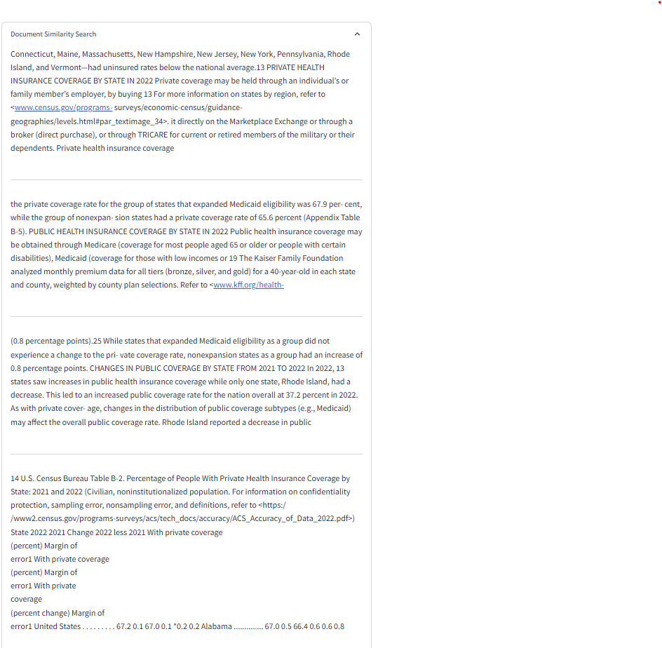

# 📚 Nvidia NIM With DeepSeek R1 - RAG System

This project implements a **Retrieval-Augmented Generation (RAG) system** using **Nvidia NIM DeepSeek R1** with **FAISS for vector embeddings**. It loads documents from PDFs, creates embeddings, and allows querying using an LLM.

## 🚀 Features
- Uses **Nvidia NIM** (`DeepSeek R1`) for answering questions.
- **Retrieval-Augmented Generation (RAG)** for document-based Q&A.
- **FAISS-based Vector Store** for efficient document search.
- **Streamlit UI** for user interaction.
- **Persists embeddings** to avoid redundant computation.

---

## 🛠 Installation

### **1️⃣ Clone the Repository**
```bash
git clone https://github.com/tasnimuldatascience/E2E-DeepSeekr1-RAG-NVIDIANIM.git
cd nvidia-nim-rag
```

### **2️⃣ Create a Virtual Environment**
```bash
python -m venv venv
source venv/bin/activate  # For Mac/Linux
venv\Scripts\activate      # For Windows
```

### **3️⃣ Install Dependencies**
```bash
pip install -r requirements.txt
```

---

## 🔑 API Key Setup
You need an **Nvidia API Key** to use `DeepSeek R1`. 

### **1️⃣ Set Up .env File**
Create a `.env` file in the project root and add:
```
NVIDIA_API_KEY=your_api_key_here
```

### **2️⃣ Load the API Key**
Make sure the script reads the API key from `.env`:
```python
from dotenv import load_dotenv
import os

load_dotenv()
os.environ['NVIDIA_API_KEY'] = os.getenv("NVIDIA_API_KEY")
```

---

## 📂 Folder Structure
```
📦 nvidia-nim-rag
 ┣ 📂 us_census            # Folder for PDF documents
 ┣ 📂 faiss_index          # Stored FAISS vector index
 ┣ 📜 app.py               # Main Streamlit app
 ┣ 📜 requirements.txt      # Python dependencies
 ┣ 📜 .env                 # API key file (not in Git)
 ┣ 📜 README.md            # This README file
```

---

## 🏃‍♂️ Running the App
After setup, launch the **Streamlit UI**:
```bash
streamlit run app.py
```

This will open a browser with the application.

---

## 📝 Usage Instructions
1. **Embed Documents**: Click the **"Documents Embedding"** button to create/load FAISS vectors.
2. **Ask Questions**: Enter a query in the text box and get AI-powered responses.
3. **View Similar Documents**: Expand "Document Similarity Search" to see retrieved texts.

---

## 📊 Screenshots
### **Document Similarity Search Example**


### **Generated Answer Example**


---

## 🛠 Troubleshooting

### **1️⃣ FAISS Serialization Error**
If you encounter:
```
ValueError: The de-serialization relies on loading a pickle file...
```
**Solution:** Ensure `allow_dangerous_deserialization=True` in `FAISS.load_local()`.

### **2️⃣ Streamlit App Not Loading**
- Ensure the virtual environment is activated.
- Run `pip install -r requirements.txt` to install missing dependencies.
- Check that `.env` contains the correct `NVIDIA_API_KEY`.

---

## 🙌 Acknowledgments
- **Nvidia NIM** for AI models.
- **LangChain** for document processing.
- **FAISS** for vector search.

🚀 **Happy Coding!**
